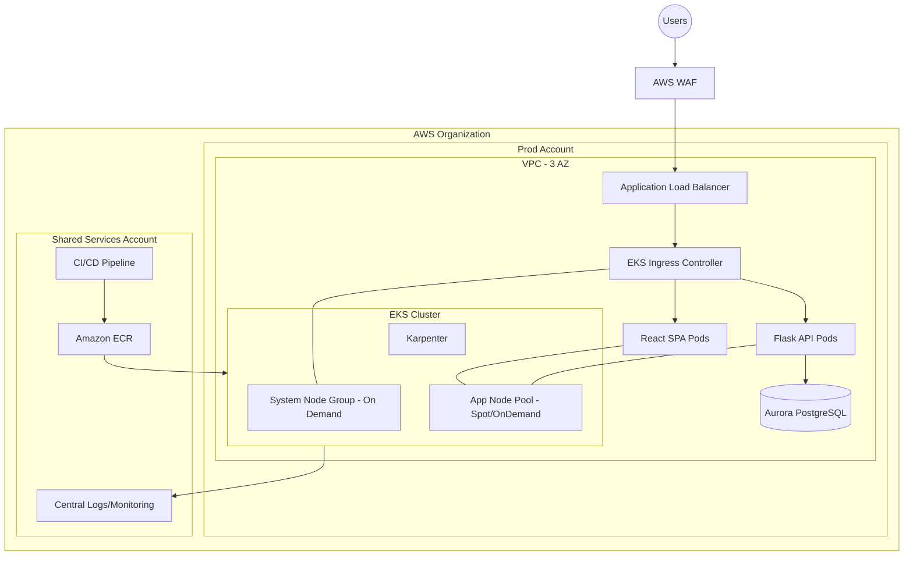

# Innovate Inc. Cloud Architecture Design (AWS)

## 1. Executive Summary

This design uses AWS managed services with Amazon EKS as the core compute platform.
It is optimized for:

- low initial cost and operational overhead
- strong security for sensitive data
- clear growth path from hundreds to millions of users
- CI/CD-first deployment model

## 2. Cloud Environment Structure (AWS Accounts)

### Recommended account model

Use AWS Organizations with at least 4 accounts:

1. `management` (organization root, billing, guardrails)
2. `shared-services` (CI/CD tooling, centralized logs, container image scanning, optional bastion)
3. `nonprod` (dev + staging workloads, separate namespaces/clusters by stage)
4. `prod` (production only)

### Why this model

- **Isolation**: production blast radius separated from development mistakes.
- **Security**: independent IAM boundaries and SCP guardrails.
- **Billing clarity**: cost split by environment/account.
- **Scalability**: easy to add dedicated accounts later (for data, security, analytics, etc.).

### IAM and access approach

- SSO/Identity Center for human access.
- Role-based access (least privilege), no long-lived user keys.
- Break-glass admin role with strict controls and MFA.

## 3. Network Design

## VPC architecture (per environment)

- One VPC per environment account/region.
- 3 Availability Zones.
- Subnets per AZ:
  - public subnets: only ALB/NAT if needed
  - private app subnets: EKS worker nodes
  - private data subnets: PostgreSQL/Aurora
- NAT Gateway strategy:
  - nonprod: single NAT for cost control
  - prod: one NAT per AZ for higher availability
- VPC endpoints for AWS APIs (ECR, S3, STS, CloudWatch, Secrets Manager) to reduce internet dependence.

## Network security controls

- EKS nodes in private subnets only.
- Public ingress via AWS WAF -> ALB -> Ingress Controller.
- Security groups:
  - ALB SG allows 443 from internet.
  - Node SG allows only required app and cluster traffic.
  - DB SG allows 5432 only from app/node SG.
- NACLs kept simple; SGs used for fine-grained policy.
- TLS everywhere (edge and in-cluster where applicable).

## 4. Compute Platform (Amazon EKS)

## Kubernetes service approach

- Amazon EKS managed control plane.
- Separate clusters for nonprod and prod (recommended).
- GitOps (Argo CD or Flux) for application deployments.

## Node groups and scaling

Use mixed-capacity strategy:

1. **System node group (On-Demand, small)**
   - Runs critical cluster components (CoreDNS, ingress controller, GitOps controller).
2. **General app node pool (Spot-first + On-Demand fallback)**
   - Main workload pool for API/frontend pods.
3. **Optional dedicated pools**
   - Background workers, compute-heavy jobs, or memory-heavy services.

Scaling strategy:

- Horizontal Pod Autoscaler (HPA) based on CPU/memory + custom metrics.
- Cluster autoscaling with Karpenter for fast node provisioning and flexible instance selection.
- PodDisruptionBudgets and topology spread constraints to keep availability during disruptions.

Resource allocation:

- Enforce requests/limits on all workloads.
- Namespace-level ResourceQuotas and LimitRanges.
- Priority classes for critical services.

## Containerization and deployment process

Build and image management:

- Docker multi-stage builds for Flask and React artifacts.
- Store images in Amazon ECR.
- Enable ECR vulnerability scanning.
- Generate SBOM and sign images (e.g., cosign).

CI/CD pipeline (high level):

1. PR checks: lint + unit tests + SAST + dependency scan.
2. Build images and push to ECR on merge.
3. Deploy to nonprod automatically.
4. Integration tests and smoke tests.
5. Promote to prod via approval gate + progressive rollout (canary/blue-green).

Kubernetes rollout safety:

- readiness/liveness probes
- rolling updates with maxUnavailable controls
- automated rollback on failed health checks

## 5. Database (PostgreSQL)

## Recommended service

**Amazon Aurora PostgreSQL (Serverless v2)** for production growth path.

Why:

- managed PostgreSQL compatibility
- automatic high availability across AZs
- elastic scaling for variable startup traffic
- read replicas for scale-out reads

For very early cost sensitivity, standard RDS PostgreSQL Multi-AZ is acceptable, with migration path to Aurora later.

## Backup, HA, and DR strategy

High Availability:

- Multi-AZ cluster deployment.
- Automatic failover.

Backups:

- Automated backups (7-35 days depending on policy).
- PITR enabled.
- Snapshot schedule for long-term retention.

Disaster Recovery:

- Cross-region snapshot copy.
- Target RPO/RTO definition (example: RPO <= 15 min, RTO <= 1 hour).
- Runbook and regular restore testing.

Data security:

- Encryption at rest using KMS.
- TLS in transit.
- Credentials in Secrets Manager, rotated automatically.
- Database access only from application SG.

## 6. Security Best Practices

- AWS Organizations SCP guardrails (deny unsafe public resource patterns).
- CloudTrail organization trail enabled in all accounts.
- GuardDuty, Security Hub, and Config in prod and shared security scope.
- OPA/Gatekeeper or Kyverno policies in cluster.
- IRSA/EKS Pod Identity for pod-to-AWS permissions (no static credentials in pods).
- Secrets managed via AWS Secrets Manager + External Secrets Operator.

## 7. Observability and Operations

- Centralized logs: CloudWatch + optional OpenSearch/SIEM export.
- Metrics and alerting: Prometheus/Grafana + CloudWatch alarms.
- Tracing: OpenTelemetry (collector) + X-Ray/compatible backend.
- SLOs for API latency, error rate, and availability.
- On-call alerts integrated to Slack/PagerDuty.

## 8. Cost and Growth Strategy

Initial phase (low traffic):

- Smaller node sizes, minimal baseline capacity.
- Spot for non-critical workloads.
- Single NAT in nonprod.

Growth phase:

- Increase HPA/Karpenter bounds.
- Add read replicas and caching layer (ElastiCache/Redis).
- Introduce Global Accelerator / multi-region only when required.

Cost governance:

- Mandatory tags: `env`, `team`, `service`, `owner`.
- Budgets and anomaly detection.
- Rightsizing reviews monthly.

## 9. High-Level Diagram (HDL)

See [diagrams/high-level-architecture.mmd](./diagrams/high-level-architecture.mmd).

## 10. Implementation Notes (next step)

If requested, this architecture can be converted to Terraform modules in this order:

1. account/org baseline
2. network baseline
3. EKS baseline + platform add-ons
4. database baseline
5. CI/CD + GitOps bootstrap
